# 📘 Biotics App  

A modern **Flutter e-learning app** for biology education.  
Built with **Clean Architecture**, powered by **Firebase** (auth & real-time sync) and **Supabase** (storage) and **Hive** (Local Database).  

---

## 📖 About  

I developed a fully functional **e-learning application** focused on **biology education**.  
The app provides structured content, quizzes, exams, and gamified learning.

---

## 🚀 Features  

### 🔐 Authentication  
- Sign-in / Sign-up  
- Email Verification  
- Reset Password  
- Logout  

### 📚 Lesson Content  
- Curriculum structured into **Units → chapters → lessons**  
- Interactive **quizzes**  
- Real-time updates synced with Firebase  

### 📝 Quizzes & Exams  
- Lesson quizzes with multiple question types (MCQ, True/False, Images)  
- Teacher-assigned **scheduled exams** with countdown timers  
- Auto-grading for quizzes and partial/manual grading for exams  
- Single attempt & auto-submit when time ends  
- Exam result screen with detailed review  

### 🏆 Gamification  
- Leaderboard showing top students  
- XP points.

### ⚡ Performance & Storage  
- Cached images for faster loading  
- Firebase for real-time sync  
- Supabase for secure media storage  

### 👤 User Profile  
- Edit Name, Email, Phone Number, and Avatar  
- Manage personal account settings  

---

## 📱 Preview  

### Splash Screen  
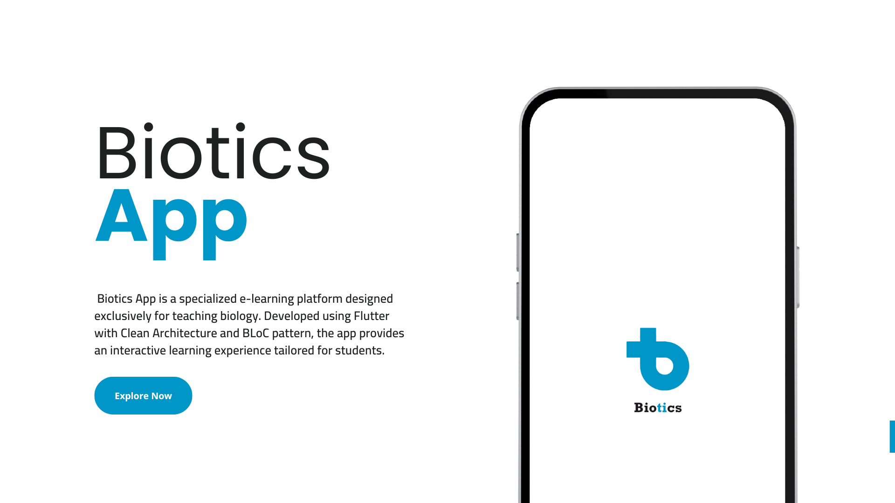  

### Welcome To Biotics  
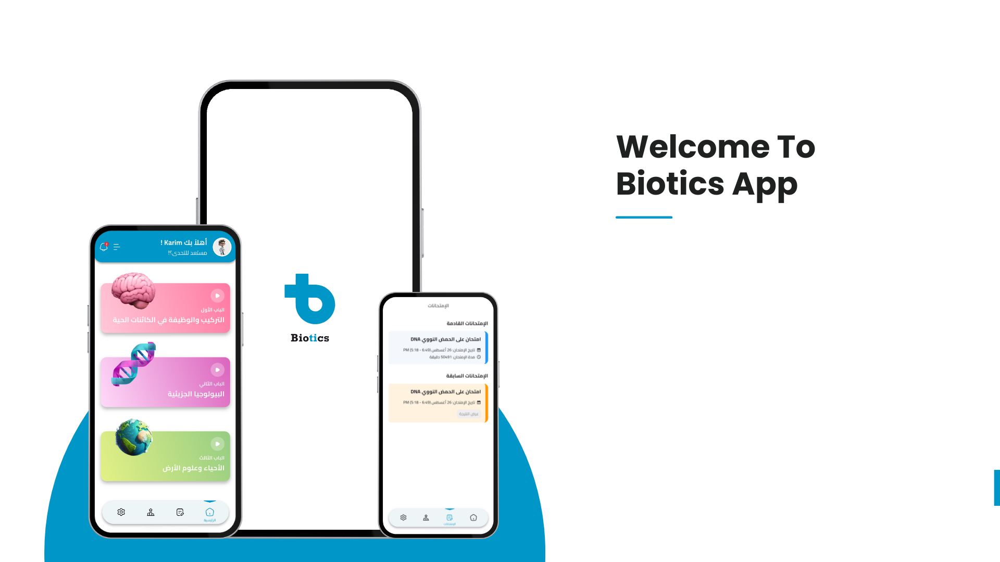  

### Onboarding Screens  
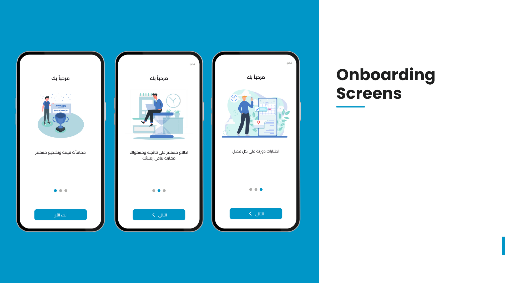  

### Auth Screens  
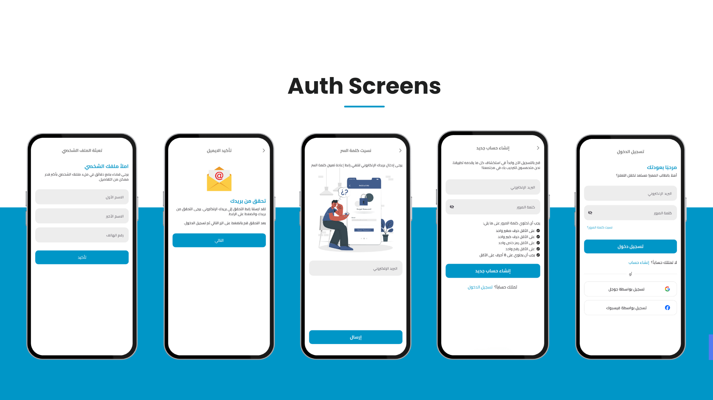  

### Curriculum Screens  
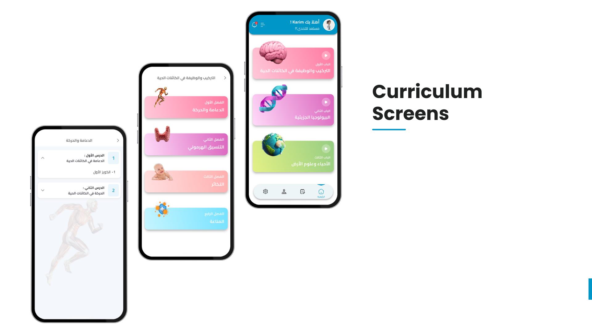  

### Quiz Screens  
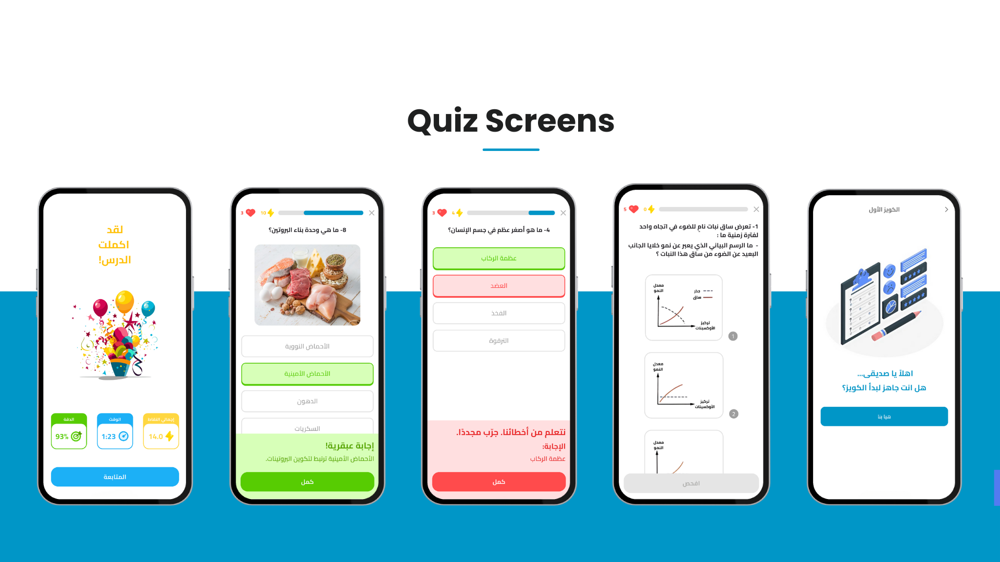  

### Exam Screens  
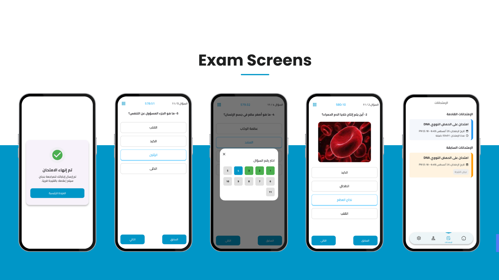  

### Exam Result Screens  
  

### Leaderboard Screen  
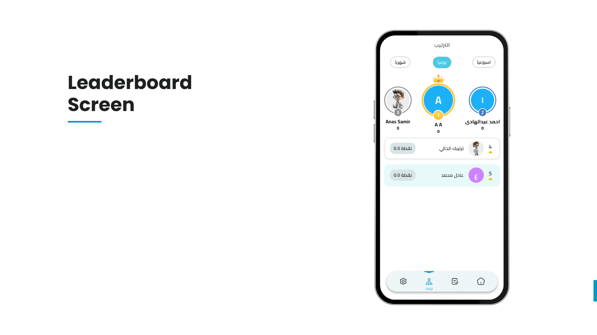  

### Settings Screens  
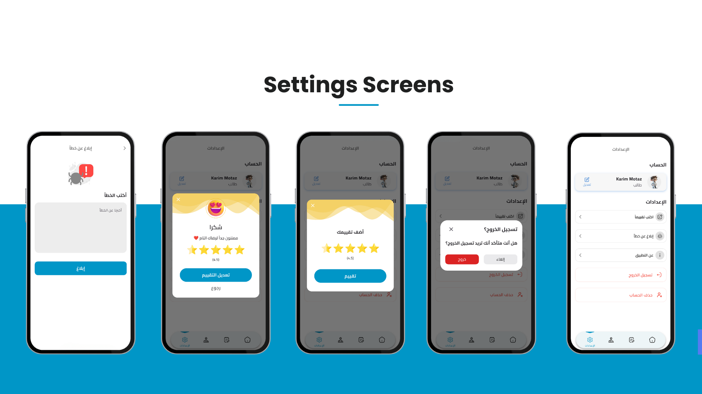  

### Settings Screens Continue
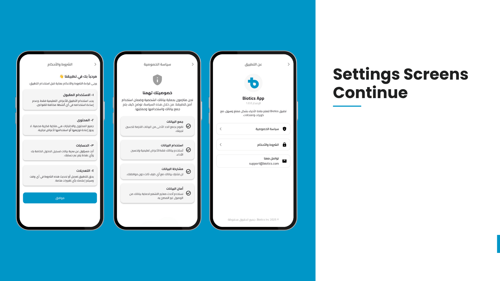  

### Profile Screen  
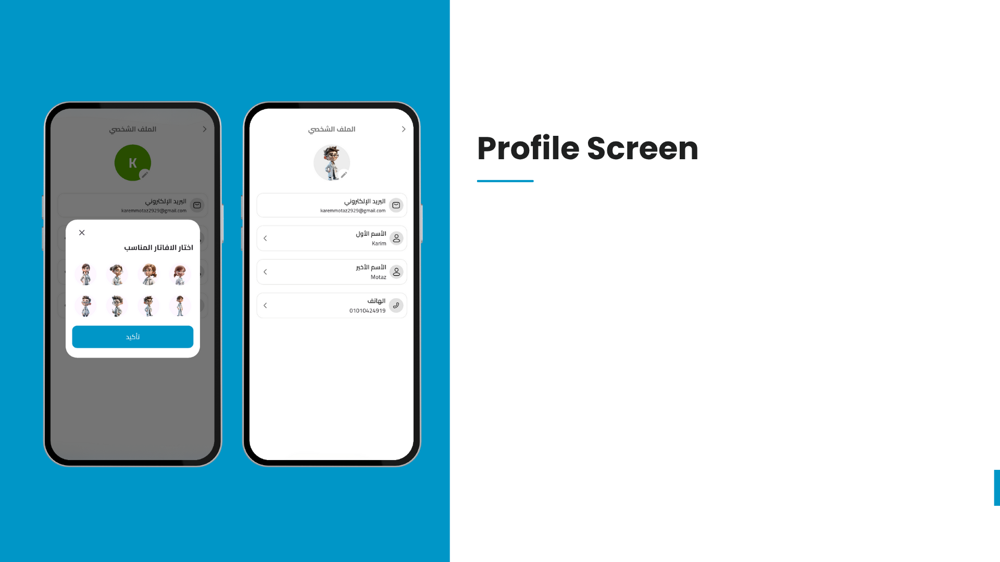  

### No Internet Screen  
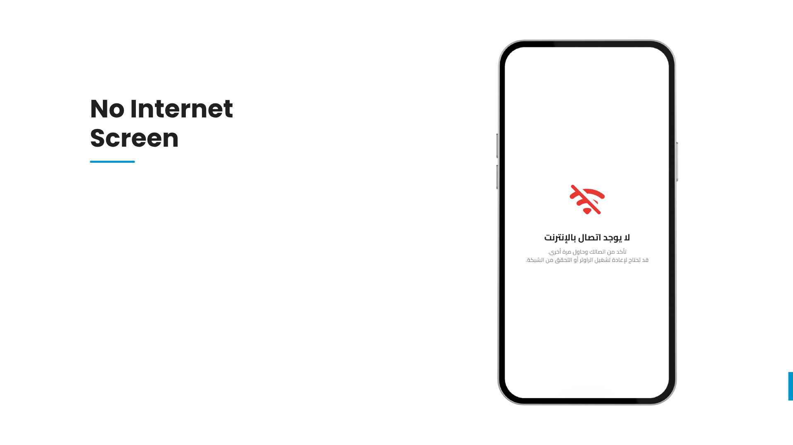  

### Contact Us  
  

### Thank You For Your Time  
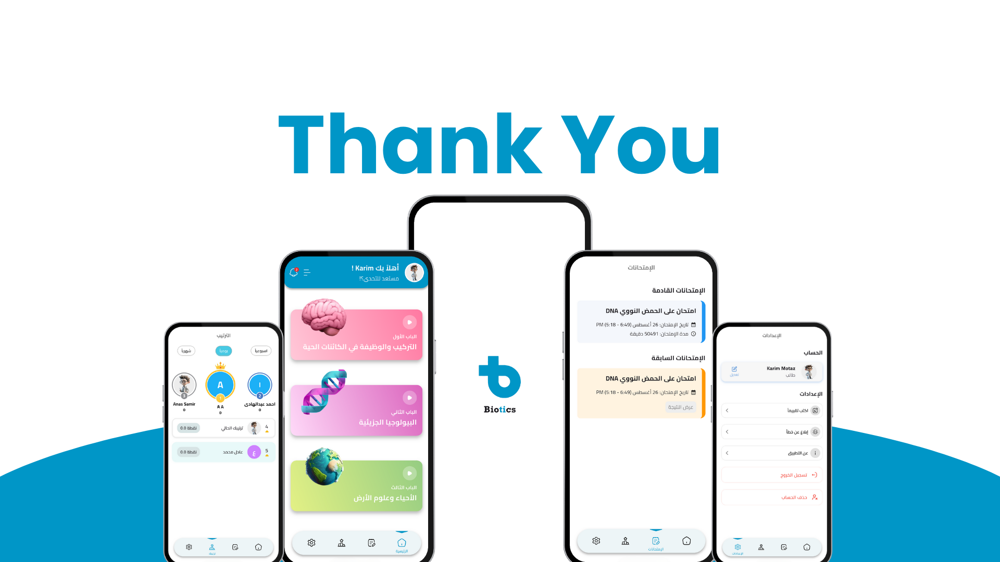  

---

## 🛠️ Tech Stack  
- **Flutter** (Clean Architecture + BLoC/Cubit)  
- **Firebase** (Authentication, Firestore, Real-time sync)  
- **Supabase** (Media storage)  
- **Hive** (Local storage & caching)  

---

## 📩 Contact  

If you’d like to collaborate or learn more:  
📧 Email: [karemmotaz2929@gmail.com]  
🌐 LinkedIn: [https://www.linkedin.com/in/karem-motaz-bb55a9213/]  

---
