#  Biotics App
A new Flutter e-learning App.

## About
I developed a fully functional e-learning application focused on biology education using Flutter. The app follows Clean Architecture and integrates Firebase services for authentication , and real-time data sync and integrates supabase for storage.

## Features
**Authentication:** 
- Sign-in, Sign-up, Reset password, Logout, Verify email

**User Profile:** 
- Edit user information (Name, Email, Avatar,Phone Number)

**Lesson Content:** 
- View quizzes

**Database Structure:**

- Courses structured into units, chapters, and lessons

**Performance:**

- Cached images for faster load times

## Preview
### Splash Screen
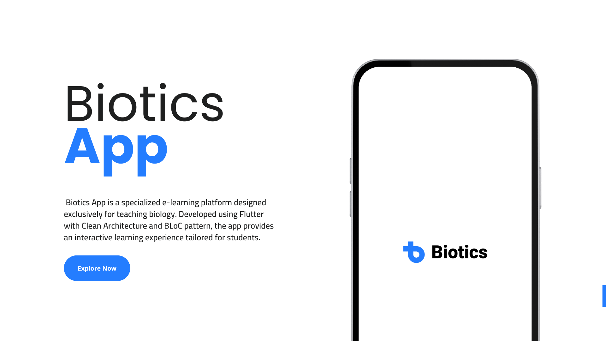
### Welcome To Biotics
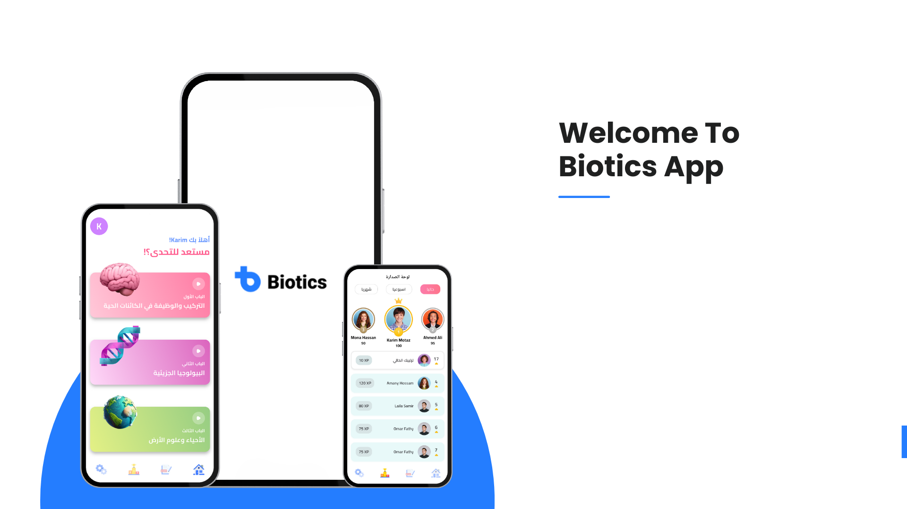
### Onboarding Screen
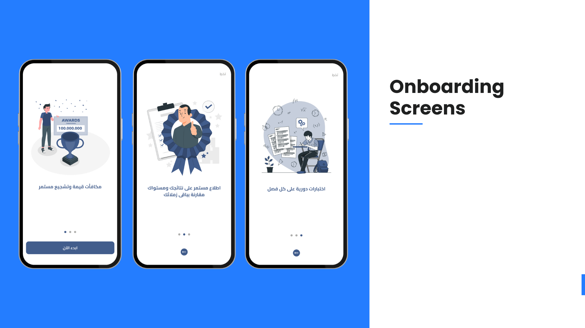
### Auth Screens
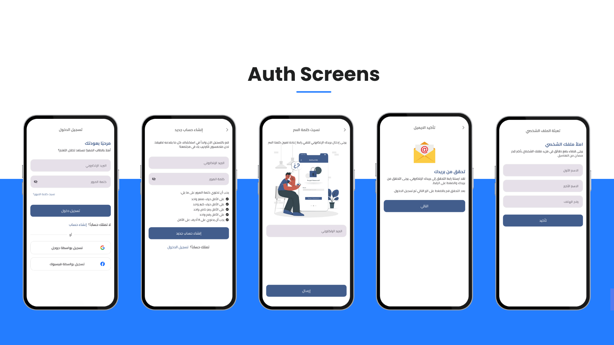
### Curriculum Screens
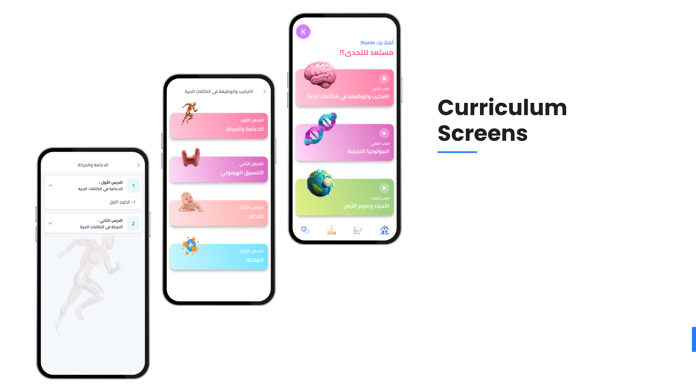
### Quiz Screens
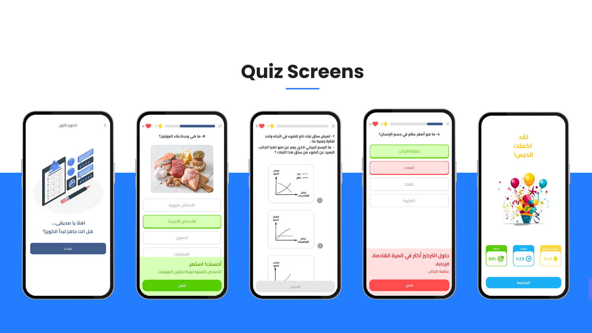
### Exam Screens
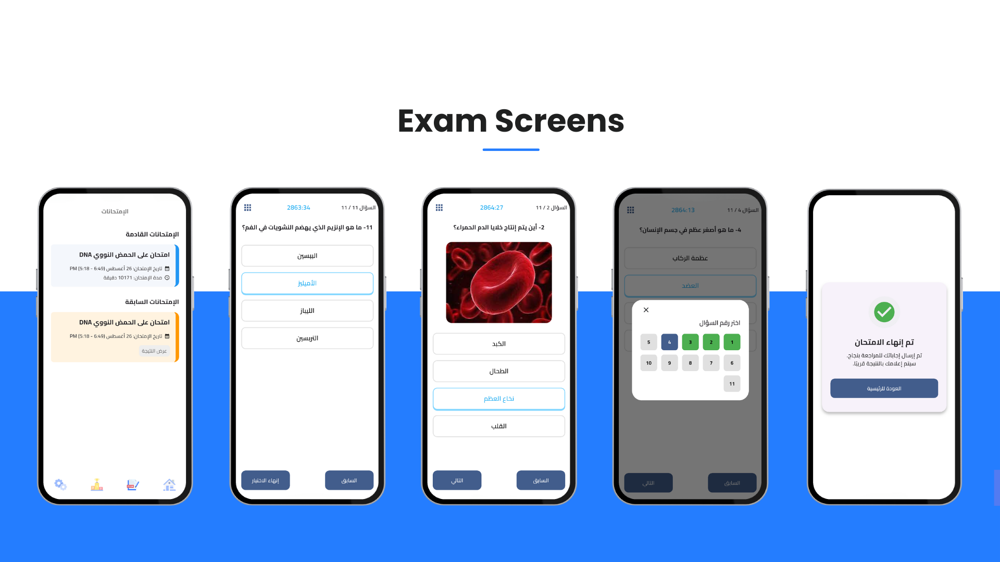
### Exam Result Screens
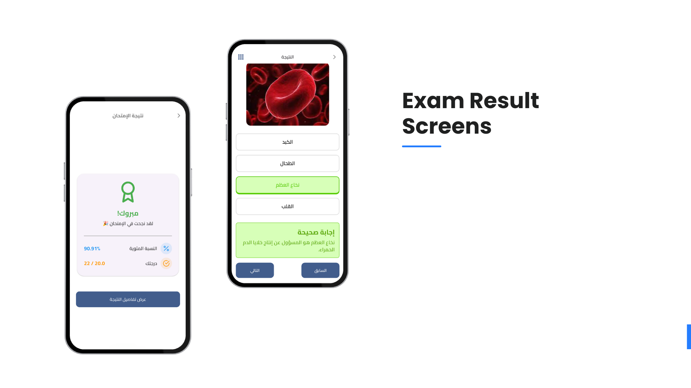
### Leaderboard Screen
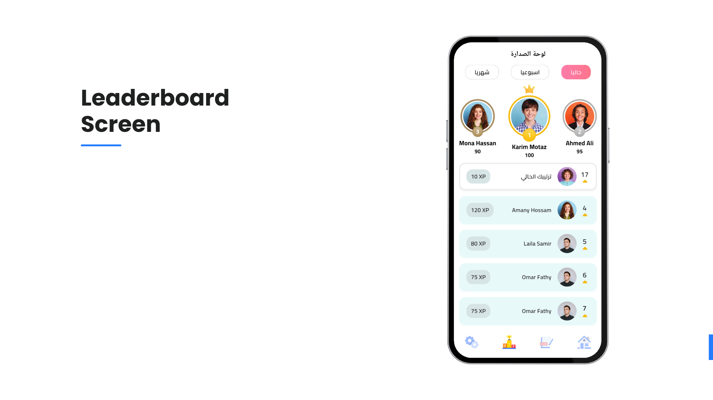
### Settings Screen
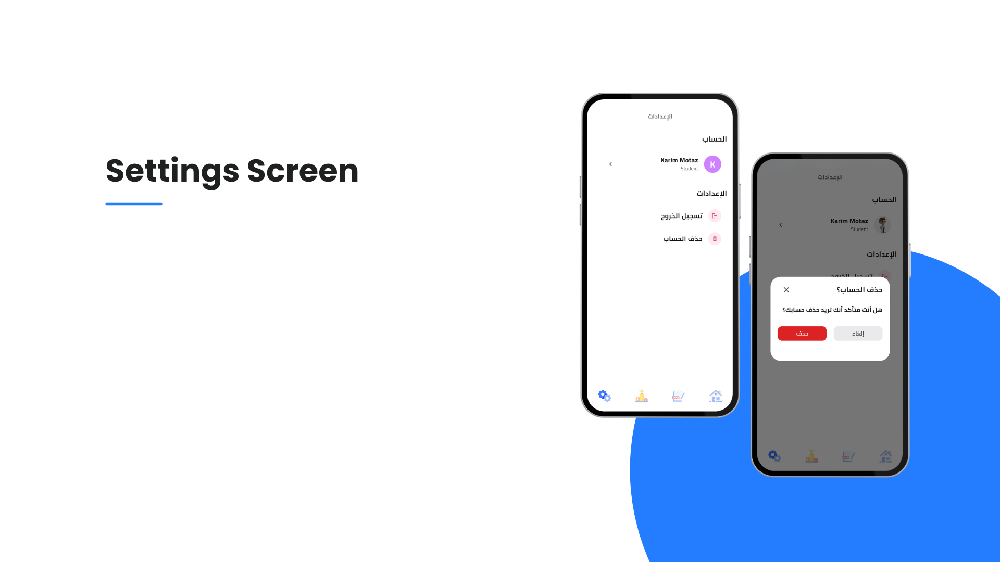
### Profile Screen
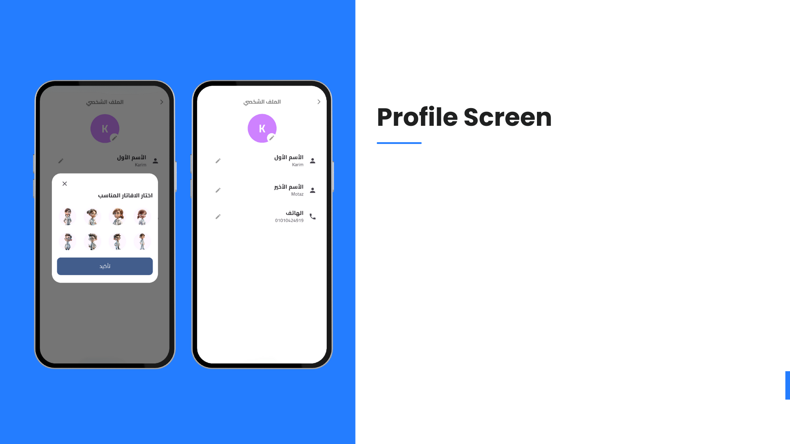
### No Internet Screen

### Contact Us
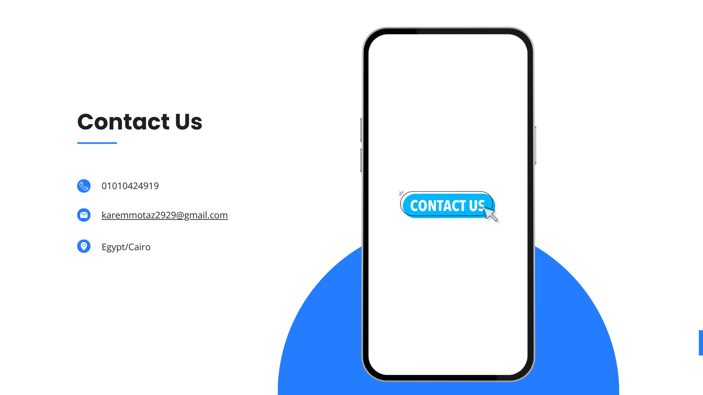
### Thank To Your Time
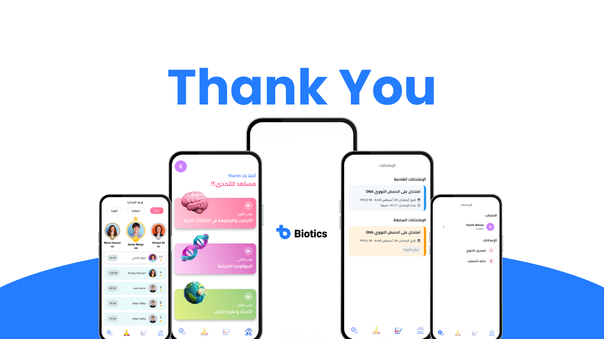
